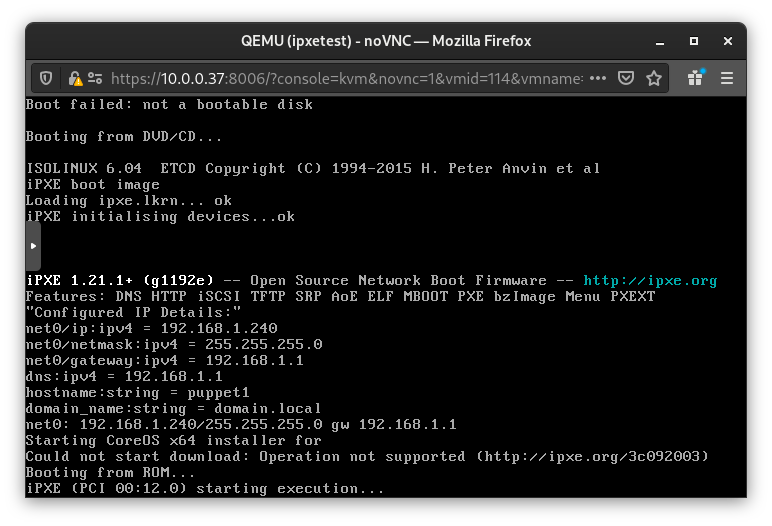

# coreos-ipxe

bash build.sh

# interactive
```sh
sudo podman run --privileged -it -v .   :/data -w data bigg01/ocp-coreos-ipxe:v1 bash
```
# full command
```sh
sudo podman run -it --privileged  -v .:/data \
 bigg01/ocp-coreos-ipxe:v1 \
 bash -c "cp -p /data/coreos-amd64-installer.ipxe /ipxe/ipxe/src/ && ls -l coreos-amd64-installer.ipxe && cd /ipxe/ipxe/src; make bin/ipxe.iso EMBED=./coreos-amd64-installer.ipxe; cp -pv bin/ipxe.iso /data"
```


## proxmox example
